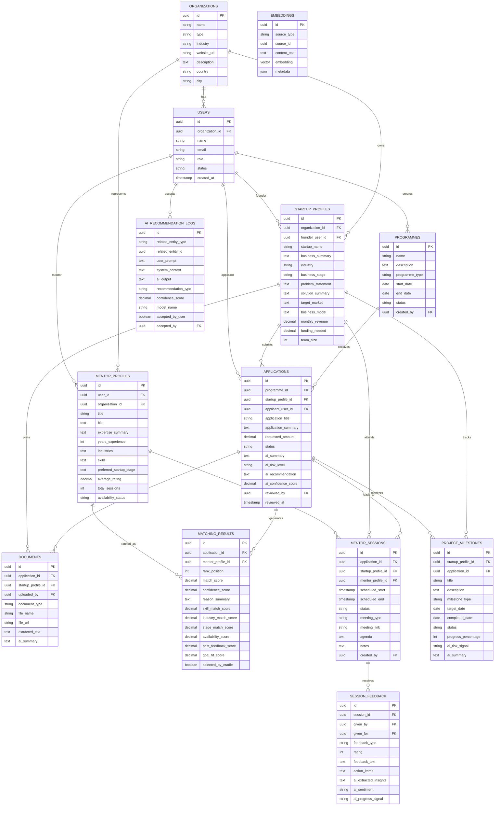

可以，Charlie。這個 Hackathon 版本不要一開始設計太大，否則會做不完。你們需要的 database schema 可以分成兩層：

第一層是 **MVP Demo 必做表**，支援申請、AI mentor matching、booking、feedback、monitoring。

第二層是 **進階加分表**，支援 ecosystem graph、AI learning、programme analytics、funding decision history。

我建議 Hackathon 先做第一層，第二層只要在 pitch deck 和 demo dashboard 裡展示概念即可。

---

## 1. 核心資料模型總覽

你們的系統主要有 6 個核心物件：

`users`：所有登入系統的人，例如 Cradle staff、mentor、startup founder
`organizations`：startup、mentor company、partner organization、Cradle
`programmes`：Cradle 的 funding programme / accelerator programme / event
`applications`：startup 對某個 programme 的申請
`mentors`：mentor profile，包含技能、產業、經驗
`matching_results`：AI 推薦 mentor 的結果與分數

然後再加上：

`mentor_sessions`：mentor 和 startup 的 session booking
`session_feedback`：session 後的 feedback
`project_milestones`：startup project 的 milestone tracking
`ai_recommendation_logs`：AI 曾經做過什麼建議，給了什麼原因
`documents`：startup 上傳的 pitch deck、business plan、financial document
`embeddings`：用於 vector search / semantic matching 的資料

---

## 2. MVP 必做 Schema

下面是最適合 Hackathon 的 MVP database schema。

---

## 2.1 users

這張表管理所有系統使用者。

```sql
CREATE TABLE users (
    id UUID PRIMARY KEY,
    organization_id UUID NULL,

    name VARCHAR(255) NOT NULL,
    email VARCHAR(255) UNIQUE NOT NULL,
    password_hash TEXT NULL,

    role VARCHAR(50) NOT NULL,
    -- roles: cradle_admin, cradle_staff, mentor, founder, partner

    status VARCHAR(50) DEFAULT 'active',
    -- active, inactive, invited, suspended

    created_at TIMESTAMP DEFAULT CURRENT_TIMESTAMP,
    updated_at TIMESTAMP DEFAULT CURRENT_TIMESTAMP
);
```

用途：

Cradle staff 登入後可以審核 application。
Mentor 登入後可以查看 session。
Founder 登入後可以提交 application。

---

## 2.2 organizations

這張表代表公司、startup、Cradle、partner、mentor 所屬機構。

```sql
CREATE TABLE organizations (
    id UUID PRIMARY KEY,

    name VARCHAR(255) NOT NULL,
    type VARCHAR(50) NOT NULL,
    -- cradle, startup, mentor_company, partner, investor

    industry VARCHAR(100) NULL,
    website_url TEXT NULL,
    description TEXT NULL,

    country VARCHAR(100) DEFAULT 'Malaysia',
    city VARCHAR(100) NULL,

    created_at TIMESTAMP DEFAULT CURRENT_TIMESTAMP,
    updated_at TIMESTAMP DEFAULT CURRENT_TIMESTAMP
);
```

這張表很重要，因為你們的系統不是只管理 individual，而是管理整個 startup ecosystem。

---

## 2.3 programmes

代表 Cradle 舉辦的 funding programme、mentor programme、accelerator、event。

```sql
CREATE TABLE programmes (
    id UUID PRIMARY KEY,

    name VARCHAR(255) NOT NULL,
    description TEXT NULL,

    programme_type VARCHAR(100) NOT NULL,
    -- funding, accelerator, bootcamp, grant, mentorship

    start_date DATE NULL,
    end_date DATE NULL,

    status VARCHAR(50) DEFAULT 'draft',
    -- draft, open, reviewing, active, completed, archived

    created_by UUID REFERENCES users(id),

    created_at TIMESTAMP DEFAULT CURRENT_TIMESTAMP,
    updated_at TIMESTAMP DEFAULT CURRENT_TIMESTAMP
);
```

Demo 例子：

`Cradle Fund Seeding 2026`
`Startup Mentor Matching Programme`
`AI Innovation Grant Programme`

---

## 2.4 startup_profiles

這張表是 startup 的詳細 profile。

```sql
CREATE TABLE startup_profiles (
    id UUID PRIMARY KEY,

    organization_id UUID NOT NULL REFERENCES organizations(id),

    founder_user_id UUID REFERENCES users(id),

    startup_name VARCHAR(255) NOT NULL,
    business_summary TEXT NOT NULL,

    industry VARCHAR(100) NULL,
    business_stage VARCHAR(100) NULL,
    -- idea, prototype, mvp, revenue, growth

    problem_statement TEXT NULL,
    solution_summary TEXT NULL,
    target_market TEXT NULL,
    business_model TEXT NULL,

    monthly_revenue DECIMAL(12,2) DEFAULT 0,
    funding_needed DECIMAL(12,2) NULL,

    team_size INT DEFAULT 1,

    created_at TIMESTAMP DEFAULT CURRENT_TIMESTAMP,
    updated_at TIMESTAMP DEFAULT CURRENT_TIMESTAMP
);
```

這張表會給 AI 用來理解 startup。

例如 Ali 的 startup profile：

industry = FoodTech
business_stage = MVP
funding_needed = RM 150,000
problem_statement = small food vendors struggle with inventory and digital ordering
solution_summary = QR ordering + inventory tracking platform

---

## 2.5 mentor_profiles

這張表代表 mentor 的能力與背景。

```sql
CREATE TABLE mentor_profiles (
    id UUID PRIMARY KEY,

    user_id UUID NOT NULL REFERENCES users(id),
    organization_id UUID NULL REFERENCES organizations(id),

    title VARCHAR(255) NULL,
    bio TEXT NULL,

    expertise_summary TEXT NULL,

    years_experience INT NULL,

    industries TEXT[] NULL,
    -- Example: ['FinTech', 'SaaS', 'Ecommerce']

    skills TEXT[] NULL,
    -- Example: ['fundraising', 'product strategy', 'go-to-market', 'UX', 'AI']

    preferred_startup_stage TEXT[] NULL,
    -- Example: ['idea', 'mvp', 'revenue']

    average_rating DECIMAL(3,2) DEFAULT 0,
    total_sessions INT DEFAULT 0,

    availability_status VARCHAR(50) DEFAULT 'available',
    -- available, limited, unavailable

    created_at TIMESTAMP DEFAULT CURRENT_TIMESTAMP,
    updated_at TIMESTAMP DEFAULT CURRENT_TIMESTAMP
);
```

Hackathon demo 裡的 Top 3 Mentor 就是從這張表選出來。

---

## 2.6 applications

這是最重要的表之一。代表 startup 對 programme 的申請。

```sql
CREATE TABLE applications (
    id UUID PRIMARY KEY,

    programme_id UUID NOT NULL REFERENCES programmes(id),
    startup_profile_id UUID NOT NULL REFERENCES startup_profiles(id),

    applicant_user_id UUID NOT NULL REFERENCES users(id),

    application_title VARCHAR(255) NOT NULL,
    application_summary TEXT NULL,

    requested_amount DECIMAL(12,2) NULL,

    status VARCHAR(50) DEFAULT 'submitted',
    -- draft, submitted, ai_reviewed, shortlisted, approved, rejected, assigned_mentor

    ai_summary TEXT NULL,
    ai_risk_level VARCHAR(50) NULL,
    -- low, medium, high

    ai_recommendation TEXT NULL,
    ai_confidence_score DECIMAL(5,2) NULL,

    reviewed_by UUID NULL REFERENCES users(id),
    reviewed_at TIMESTAMP NULL,

    created_at TIMESTAMP DEFAULT CURRENT_TIMESTAMP,
    updated_at TIMESTAMP DEFAULT CURRENT_TIMESTAMP
);
```

這張表用於展示：

Ali submit application
AI summarize application
Cradle staff approve / reject
Cradle staff assign mentor

---

## 2.7 documents

申請者上傳的文件。

```sql
CREATE TABLE documents (
    id UUID PRIMARY KEY,

    application_id UUID NULL REFERENCES applications(id),
    startup_profile_id UUID NULL REFERENCES startup_profiles(id),

    uploaded_by UUID REFERENCES users(id),

    document_type VARCHAR(100) NOT NULL,
    -- pitch_deck, business_plan, financial_statement, company_profile, other

    file_name VARCHAR(255) NOT NULL,
    file_url TEXT NOT NULL,
    mime_type VARCHAR(100) NULL,
    file_size_bytes BIGINT NULL,

    extracted_text TEXT NULL,
    ai_summary TEXT NULL,

    created_at TIMESTAMP DEFAULT CURRENT_TIMESTAMP
);
```

Demo 不一定真的要做完整 file upload，可以 fake 一份 uploaded document，但 schema 要有。

AI 可以從 `extracted_text` 生成 summary。

---

## 2.8 matching_results

這張表是 AI mentor matching 的核心。

```sql
CREATE TABLE matching_results (
    id UUID PRIMARY KEY,

    application_id UUID NOT NULL REFERENCES applications(id),
    mentor_profile_id UUID NOT NULL REFERENCES mentor_profiles(id),

    rank_position INT NOT NULL,
    match_score DECIMAL(5,2) NOT NULL,
    -- Example: 94.50

    confidence_score DECIMAL(5,2) NULL,

    reason_summary TEXT NOT NULL,

    skill_match_score DECIMAL(5,2) DEFAULT 0,
    industry_match_score DECIMAL(5,2) DEFAULT 0,
    stage_match_score DECIMAL(5,2) DEFAULT 0,
    availability_score DECIMAL(5,2) DEFAULT 0,
    past_feedback_score DECIMAL(5,2) DEFAULT 0,
    goal_fit_score DECIMAL(5,2) DEFAULT 0,

    ai_model_name VARCHAR(100) NULL,

    selected_by_cradle BOOLEAN DEFAULT FALSE,
    selected_at TIMESTAMP NULL,

    created_at TIMESTAMP DEFAULT CURRENT_TIMESTAMP
);
```

這張表是你們 demo 的重點。

畫面可以顯示：

Mentor A
Score: 94%
Reason: Strong UX and early-stage SaaS match. Previously helped 3 similar startups improve MVP positioning. Available next week.

Mentor B
Score: 89%
Reason: Strong go-to-market experience and relevant FoodTech background.

Mentor C
Score: 86%
Reason: Deep technical and AI product architecture overlap.

---

## 2.9 mentor_sessions

當 Cradle 選好 mentor 後，就建立 session。

```sql
CREATE TABLE mentor_sessions (
    id UUID PRIMARY KEY,

    application_id UUID NOT NULL REFERENCES applications(id),
    startup_profile_id UUID NOT NULL REFERENCES startup_profiles(id),
    mentor_profile_id UUID NOT NULL REFERENCES mentor_profiles(id),

    scheduled_start TIMESTAMP NOT NULL,
    scheduled_end TIMESTAMP NOT NULL,

    status VARCHAR(50) DEFAULT 'pending',
    -- pending, accepted, rejected, rescheduled, completed, cancelled, no_show

    meeting_type VARCHAR(50) DEFAULT 'online',
    -- online, physical, hybrid

    meeting_link TEXT NULL,
    location TEXT NULL,

    agenda TEXT NULL,
    notes TEXT NULL,

    created_by UUID REFERENCES users(id),

    created_at TIMESTAMP DEFAULT CURRENT_TIMESTAMP,
    updated_at TIMESTAMP DEFAULT CURRENT_TIMESTAMP
);
```

這張表用於 session booking showcase。

---

## 2.10 session_feedback

session 完成後，startup 和 mentor 都可以給 feedback。

```sql
CREATE TABLE session_feedback (
    id UUID PRIMARY KEY,

    session_id UUID NOT NULL REFERENCES mentor_sessions(id),

    given_by UUID NOT NULL REFERENCES users(id),
    given_for UUID NULL REFERENCES users(id),

    feedback_type VARCHAR(50) NOT NULL,
    -- startup_to_mentor, mentor_to_startup, cradle_observation

    rating INT CHECK (rating BETWEEN 1 AND 5),

    feedback_text TEXT NULL,

    action_items TEXT[] NULL,

    ai_extracted_insights TEXT NULL,
    ai_sentiment VARCHAR(50) NULL,
    -- positive, neutral, negative

    ai_progress_signal VARCHAR(50) NULL,
    -- improving, stuck, declining, unclear

    created_at TIMESTAMP DEFAULT CURRENT_TIMESTAMP
);
```

這張表可以幫你們展示：

這次 session 有沒有幫助？
mentor 是否適合？
startup 是否有進步？
AI 如何從 feedback 學習？

---

## 2.11 project_milestones

用來 monitoring startup project。

```sql
CREATE TABLE project_milestones (
    id UUID PRIMARY KEY,

    startup_profile_id UUID NOT NULL REFERENCES startup_profiles(id),
    application_id UUID NULL REFERENCES applications(id),

    title VARCHAR(255) NOT NULL,
    description TEXT NULL,

    milestone_type VARCHAR(100) NULL,
    -- product, revenue, customer, partnership, funding, compliance

    target_date DATE NULL,
    completed_date DATE NULL,

    status VARCHAR(50) DEFAULT 'not_started',
    -- not_started, in_progress, completed, delayed, blocked

    progress_percentage INT DEFAULT 0 CHECK (progress_percentage BETWEEN 0 AND 100),

    evidence_url TEXT NULL,

    ai_risk_signal VARCHAR(50) NULL,
    -- low, medium, high

    ai_summary TEXT NULL,

    created_at TIMESTAMP DEFAULT CURRENT_TIMESTAMP,
    updated_at TIMESTAMP DEFAULT CURRENT_TIMESTAMP
);
```

這是 monitoring dashboard 的資料來源。

---

## 2.12 ai_recommendation_logs

這張表記錄 AI 每次建議，方便 explainability 和 audit。

```sql
CREATE TABLE ai_recommendation_logs (
    id UUID PRIMARY KEY,

    related_entity_type VARCHAR(100) NOT NULL,
    -- application, mentor_matching, milestone, funding_review

    related_entity_id UUID NOT NULL,

    user_prompt TEXT NULL,
    system_context TEXT NULL,

    ai_output TEXT NOT NULL,

    recommendation_type VARCHAR(100) NOT NULL,
    -- application_summary, mentor_match, risk_analysis, funding_recommendation

    confidence_score DECIMAL(5,2) NULL,

    model_name VARCHAR(100) NULL,

    accepted_by_user BOOLEAN NULL,
    accepted_by UUID NULL REFERENCES users(id),
    accepted_at TIMESTAMP NULL,

    created_at TIMESTAMP DEFAULT CURRENT_TIMESTAMP
);
```

這張表很加分，因為可以告訴評審：

我們不是只把 AI 結果顯示出來，我們有記錄 AI 的建議、信心分數、是否被 Cradle 接受。這可以形成未來的 AI evaluation loop。

---

## 3. Vector / Embedding Schema

如果你們要自然地加入 Google technology 或 vector search，可以加一張通用 embedding 表。

PostgreSQL + pgvector 版本可以這樣：

```sql
CREATE TABLE embeddings (
    id UUID PRIMARY KEY,

    source_type VARCHAR(100) NOT NULL,
    -- startup_profile, mentor_profile, document, feedback, milestone

    source_id UUID NOT NULL,

    content_text TEXT NOT NULL,

    embedding vector(768),

    metadata JSONB NULL,

    created_at TIMESTAMP DEFAULT CURRENT_TIMESTAMP
);
```

如果你們用 Google Vertex AI Embeddings，`embedding vector(768)` 可以對應 embedding output。

這張表的用途：

startup profile 轉成 embedding
mentor profile 轉成 embedding
feedback log 轉成 embedding
documents 轉成 embedding
AI matching 時做 semantic search

你們可以在 pitch 裡說：

Application profile and mentor profiles are embedded using Vertex AI Embeddings. The system performs semantic similarity search to shortlist candidate mentors, then Gemini reranks and explains the top results.

中文就是：

系統先把申請資料與 mentor profile 轉成向量，再用語意相似度找出候選 mentor，最後由 Gemini 根據 skills、availability、feedback、goals 進行 rerank 和原因解釋。

---

## 4. ERD Mermaid 圖

你可以直接放進 markdown / pitch planning 文件。



---

## 5. Hackathon 最小可做版本

如果你們時間很短，真的只需要做這 8 張表：

```text
users
organizations
programmes
startup_profiles
mentor_profiles
applications
matching_results
mentor_sessions
session_feedback
project_milestones
```

如果連 session 也來不及完整做，那就保留：

```text
users
startup_profiles
mentor_profiles
applications
matching_results
session_feedback
project_milestones
```

最小 demo flow 仍然可以成立：

Ali submit application
Cradle opens application
AI suggests top 3 mentors
Cradle selects mentor
System shows feedback history
Dashboard shows project monitoring

---

## 6. AI Matching 可以怎麼計算？

Hackathon 不需要真的做很複雜。你們可以先用 weighted score。

```text
final_match_score =
  skill_match_score * 0.30
+ industry_match_score * 0.20
+ stage_match_score * 0.15
+ availability_score * 0.15
+ past_feedback_score * 0.10
+ goal_fit_score * 0.10
```

對應到 `matching_results` 裡面的欄位。

這樣評審會看到你們不是隨便叫 AI 推薦，而是有 decision logic。

---

## 7. 建議的 MVP Seed Data

你們 demo 時可以準備：

1 個 programme：

```text
Cradle Fund Seeding 2026
```

1 個 startup applicant：

```text
Ali FoodTech Sdn Bhd
Stage: MVP
Needs: product strategy, go-to-market, inventory automation
Funding needed: RM150,000
```

3 個 mentors：

```text
Mentor A: SaaS + UX + Early-stage MVP
Mentor B: Growth + Go-to-market + F&B
Mentor C: Deep Tech + AI + Automation
```

3 個 matching results：

```text
Mentor A: 94%
Mentor B: 89%
Mentor C: 86%
```

2 個 feedback records：

```text
Mentor A previously helped 3 MVP startups improve onboarding and product clarity.
Mentor B had strong feedback in go-to-market sessions but limited availability this month.
```

3 個 milestones：

```text
Complete MVP prototype
Acquire 10 pilot merchants
Generate first RM5,000 monthly transaction volume
```

---

## 8. 我建議你們的資料庫技術選擇

如果是 Hackathon，我建議：

**Supabase PostgreSQL** 最快。
因為有 PostgreSQL、Auth、Storage、pgvector、REST API，demo 起來快。

如果你們要強制放 Google Technology，可以這樣放：

`Cloud SQL for PostgreSQL`：主資料庫
`Vertex AI Embeddings`：產生 profile / document / feedback embedding
`Gemini API`：做 mentor rerank、summary、reason generation
`Firebase Auth`：登入
`Firebase Hosting`：前端部署
`Cloud Storage`：文件上傳

最自然的說法是：

**Transactional data is stored in Cloud SQL PostgreSQL. Uploaded documents are stored in Cloud Storage. Vertex AI creates embeddings for applications, mentor profiles, and feedback logs. Gemini reranks mentors and generates explainable recommendations for Cradle staff.**

---

## 9. 最重要的設計判斷

你們不要把 schema 做成普通 activity system。

真正要強調的是：

每一張表都在支援一個 AI learning loop。

```text
Application data
→ AI summarizes needs
→ Mentor profiles are compared
→ Matching result is generated
→ Cradle selects mentor
→ Session happens
→ Feedback is collected
→ Future matching becomes better
→ Project progress is monitored
→ Funding decision becomes more evidence-based
```

這就是你們的產品價值。
